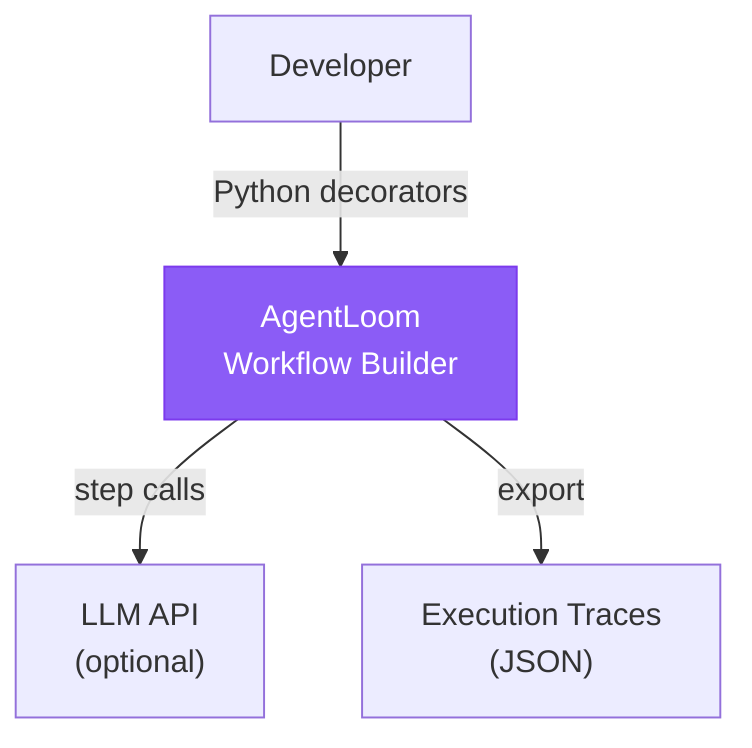
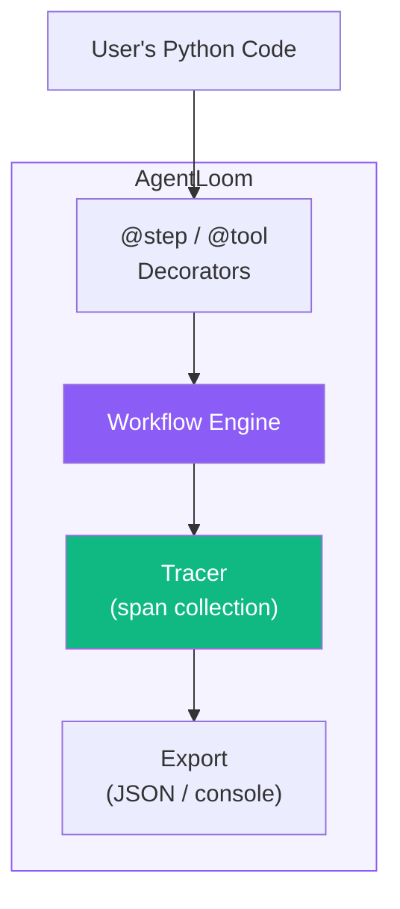
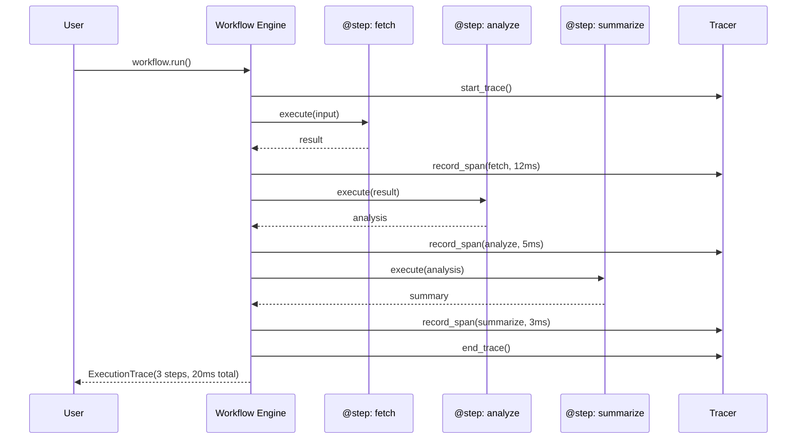

# AgentLoom Architecture

## Overview

AgentLoom provides a decorator-based Python API for building observable agent workflows. Each step is traced with timing, inputs, outputs, and status. Workflows can be sequential, conditional, or error-recovering.

## C4 Diagrams

### Level 1: System Context

### Level 2: Container Diagram

### Sequence Diagram: Workflow Execution

## Design Decisions

### Decorators vs. YAML/JSON Workflow Definition

**Chose:** Python decorators (`@step`, `@tool`).

**Why:** Native Python — no DSL to learn, full IDE support (autocomplete, type checking), easy to test individual steps. YAML definition is on the roadmap for non-developer users.

### Built-in Tracer vs. OpenTelemetry

**Chose:** Custom lightweight tracer for v0.1.

**Why:** Zero-dependency tracing that works out of the box. OpenTelemetry export is planned — the internal span model is designed to map directly to OTEL spans.

## Extension Points

1. Custom step types (async, parallel)
2. OpenTelemetry span export
3. Web UI trace viewer
4. YAML workflow definition
5. LLM-specific step types (chat, embed, classify)
